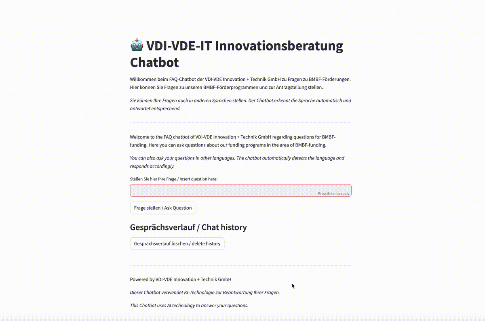
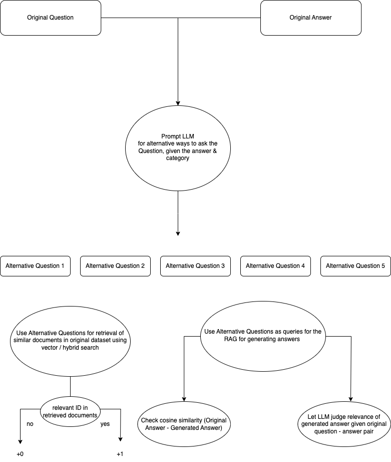
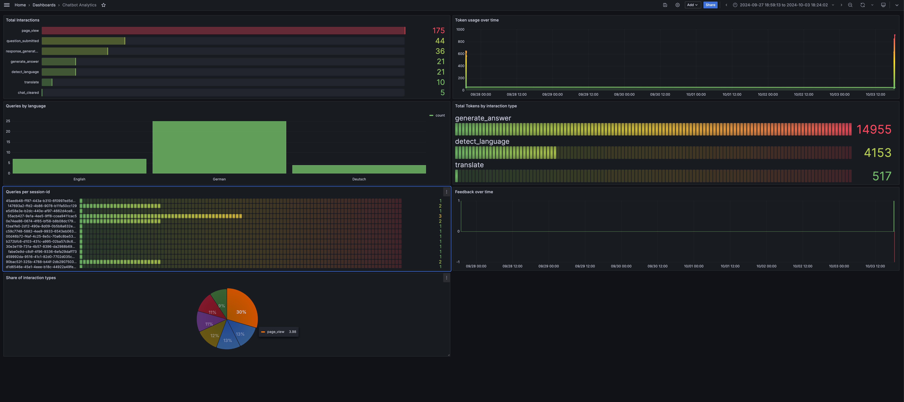

# 🤖 VDI-VDE/IT Chatbot

**...a multilingual chatbot for [VDI-VDE/IT](https://vdivde-it.de/de)**

*Note: This project was created as the final project for [LLM Zoomcamp](https://github.com/DataTalksClub/llm-zoomcamp)*

<figure>
  
  <figcaption><em>Example usage of the chatbot</em></figcaption>
</figure>
<br><br>

## Problem description

VDI/VDE-IT is a German institute that supports innovation in technology, engineering, and digital transformation, particularly focusing on research, policy, and technology by taking over "Projektträgerschaft". In Germany, a "Projektträger" is an intermediary organization that manages and oversees the administration, evaluation, and financial coordination of government-funded research and innovation projects on behalf of ministries or funding agencies. One example for the Projects can be financial grants provided by the German Federal Ministry of Education and Research (BMBF) to support research, development, and innovation projects across various fields, aiming to advance scientific knowledge, technological progress, and societal solutions.

The process to apply for BMBF project funding ("Antragstellung") involves submitting a project proposal through the electronic submission portal, typically in two stages: first, a short outline ("Projektskizze") is reviewed, and if approved, a detailed application ("Antrag") is required. This includes providing project goals, budget plans, and cooperation agreements. The project is then evaluated for scientific and financial feasibility before final approval.

To ease this process, VDI-VDE/IT offers a [FAQ-Page](https://vdivde-it.de/de/faq) with frequently asked questions regarding project funding. Based on this FAQ, they also offer a [chatbot](https://vdivde-it.de/de/chatbot-fuer-bmbf-projekte) which can already answer questions by providing you documents from the FAQ-page that match your search query. However, this approach can feel cumbersome and static; improving user experience with personalized, natural responses instead of multiple-choice options would enhance engagement.

### A RAG-Chatbot Delivers Precise, Relevant Answers Tailored to User Queries

Implementing a Retrieval-Augmented Generation (RAG) chatbot for VDI/VDE-IT enhances user support over the existing retrieval-based system. This innovative solution dynamically generates personalized responses by retrieving relevant documents from a custom knowledge base, ensuring accurate and contextually rich answers.

Designed to assist with administrative queries related to BMBF funding, the chatbot interprets complex questions, providing fast, tailored responses that improve user experience and facilitate access to information. Unlike static FAQ pages, this RAG chatbot adapts to user needs, ultimately increasing efficiency and satisfaction in navigating VDI/VDE-IT’s services.

## What is a RAG-Chatbot?

A Retrieval-Augmented Generation (RAG) chatbot is a smart system that combines two powerful technologies to give more helpful and accurate answers.

1. Retrieval: First, the chatbot looks through a database of documents (in this case, the VDI-VDE/IT FAQ knowledge base) to find information related to your question.
2. Generation: After that, it uses artificial intelligence (AI) to generate a response based on the information it found, ensuring the answer is relevant and personalized to your query.
This way, instead of simply picking a pre-written answer, the chatbot can handle more complex questions by pulling from the most relevant data and crafting a response in real-time, making it feel more natural and detailed.

## Features:

### User experience Features

- **📚 Knowledge Base**: A well-organized collection of question-answer pairs, enhanced with links and categories, created from VDI/VDE-IT's FAQs through web scraping.
- **🔍 User-Friendly Interface**: An intuitive Streamlit UI that makes it easy for users to interact with the chatbot and find relevant information.
- **📊 Usage Monitoring**: Tracks statistics on user interactions, including types of queries, languages used, and feedback, to improve the user experience continually.
- **⚙️ Background Data Processing**: Regularly scrapes relevant data and indexes it, ensuring accurate and timely responses to user queries.
- **🔒 Contextual Answer Restriction**: Limits responses to the available information retrieved, ensuring answers remain relevant and contextually appropriate.


### Technical Features

- **🔍 Retrieval Evaluation**: Utilizes text and vector-based methods in ElasticSearch, assessing the retrieval of original questions against alternative formulations from a ground truth dataset.
- **🤖 RAG Evaluation**: Evaluates the relevance of answers provided by the RAG system to alternative questions, ensuring appropriate responses to similar queries.
- **⚙️ Ingestion Pipeline**:

  - `./scrape.py`: Extracts relevant data from VDI-VDE/IT website.
  - `./app/index_docs.py`: Indexes documents in ElasticSearch, executed as part of the `docker-compose` process.
- **📊 Monitoring**:

  - Usage stats in PostgreSQL database
  - Grafana Dashboard displaying:
    - Interaction type count
    - Queries by language
    - Token usage over time
    - Total tokens used by interaction type
    - Queries per session
    - Feedback (👍/👎) over time
    - Share of interaction types

- **📦 Containerization**:

  - Docker-compose featuring the following components:
    - **🗄️ PostgreSQL Database** for storing monitoring usage data
    - **🛠️ Adminer** for accessing the database tables
    - **🔎 ElasticSearch** for indexing documents
    - **🌐 Streamlit App** for a graphical user interface
- **🔄 Reproducibility**:

  - Instructions: See [How to use](#how-to-use)
  - Dataset: `documents_with_ids.json` inside `./data` and `./app/app_data` folder
  - Dependencies managed via `docker-compose` & `requirements.txt`
- **✅ Best Practices**:

  - Hybrid search 👍
  - Document re-ranking (not implemented) ❌
  - User query rewriting (not implemented) ❌

**🌥️ Bonus**:

- Cloud Deployment (not implemented) ❌

# How to Use:

1. Install [Docker](https://docs.docker.com/engine/install/https:/), [Docker Compose](https://docs.docker.com/compose/install/) & [git](https://git-scm.com/downloads)
2. Clone this repository to your local machine

   ```
   git clone https://github.com/Alexander-Heinz/vdi_chatbot.git
   ```
3. In Terminal, navigate to project root folder, rename .env.dev to .env and edit it to add your OpenAI API Key using these commands (this will open nano editor where you can edit .env and insert your key):

   ```
   cd vdi_chatbot
   cp .env.dev .env
   rm .env.dev
   nano .env
   ```
4. Still in project root folder, run `docker-compose up` to build and run the app on your computer. This process can take some minutes and you'll be informed by the progress in terminal. As soon as you see `You can now view your Streamlit app in your browser` it should be done.
5. `http://localhost:8501`  should open in your web browser

- For grafana dashboard: The grafana dashboard is accessible under `localhost:3000`. The json file is to be found in `monitoring/grafana-dashboard.json`.
- for database viewer (adminer): http://localhost:8080/
  use following credentials:

```
database system: postgreSQL
server: postgres_db
user: postgres
password: dbPW2024!1
database: postgres
```

---

# Detailed description

A more detailed description of the project & the single steps and challenges

### 📝 Scrape relevant documents

In the first step, I looked for a way to scrape the FAQ documents on `https://www.vdivde-it.de/de/faq`. I used the search function via the dropdown menu to search for all questions in a specific category, in order to scrape them. Main Challenges were:

- Content was loaded via JavaScript, so selenium was needed for scraping
- Making my script click on an element if the answer was not fully visible, in order to see the full answer, scrape it, and then navigate back

In the end, I managed to scrape the FAQ Questions among with their respective answers and categories. I also added a link to the specific question, so the chatbot can give references to the FAQ webpage.

### 📂 Indexing documents

As a next step, the scraped documents were "indexed" via ElasticSearch. Elasticsearch is a tool that helps users quickly search through large amounts of data, like documents or records, and find exactly what they need. It’s like a supercharged search engine that makes it easy to get answers fast, even from big and complex information sources. Indexing in Elasticsearch is like creating an organized catalog for a library. When you add data to Elasticsearch, it breaks it down into searchable parts and stores it in a structured way (the "index"). This makes it easy and fast to find specific information later, just like looking up a book by its title or topic in a library catalog.

#### Simple indexing using ElasticSearch

Text indexing in Elasticsearch works like a traditional search engine. It breaks down text into individual words (tokens), stores them in a structured way, and matches them with search queries based on exact word matches or close similarities. It's great for finding specific terms or phrases in documents.

#### Advanced indexing using Vector Embeddings (sentence embeddings)

Vector (embedding-based) indexing, on the other hand, uses machine learning to represent text as numerical vectors (embeddings) that capture the meaning of the content. Instead of matching exact words, it measures how close the meaning of the query is to the meaning of the indexed text. This method is more flexible and effective for finding related or contextually similar information, even if the exact words don’t match.

### ✅ Create Ground Truth data

To evaluate retrieval & our query answers, we need some "ground truth" that we base our scores on. The ground truth consists of alternative questions that could be asked for the same answer.

### 📈 Evaluating Retrieval

As a baseline, retrieval from text-based search was evaluated using hit rate and MRR.

**Hit rate** is a sort of a success score. It tells how often the chatbot finds a relevant answer from the FAQs when a user asks a question. A higher hit rate means the chatbot is doing a good job of retrieving the right answers.

**MRR (Mean Reciprocal Rank)** is a way to measure not just if the chatbot found a correct answer based on a user query, but also how much "on top" the correct answer was ranked. In my case, MRR (Mean Reciprocal Rank) measures how well the chatbot retrieves the right answers from the FAQs based on alternative ways of asking the same question. After generating similar questions, the chatbot searches for the best matches in our documents using ElasticSearch, and the top 5 results are ranked. MRR checks how high the correct document (question-answer-pair which the "alternative question" was based on) appears in those rankings—the sooner it shows up (like in the first or second position), the better the score. This way, you can tell how effectively the chatbot finds the right information, even with different ways of asking the question.

- Retrieval evaluation

  - for each record (Answer) in the FAQ, generate 5 questions which possibly address this answer.
  - Next, we input the questions into our search function to see if the desired answer would actually be among our top results
  - Use scoring algorithms to get an objective measure of retrieval quality
  - Caveat: We did not verify that the questions are actually valid, since we created the "ground truth" using an LLM. So we also have a bias due to inaccurate ground truth data, and what we measure might also reflect these inaccuracies during ground truth creation.

### 📊 Evaluating the RAG

In this step, I generated answers based on the "ground truth" dataset, which consists of alternative ways of answering a question.

The goal was to see whether my RAG answers questions correctly if the questions are formulated in a different way.

We can compare the given answers to our alternative questions with the original answers in our dataset by using cosine similarity

<figure>
  
  <figcaption><em>Fig. 3: Monitoring data in the postgres database</em></figcaption>
</figure>
<br><br>

...or by using LLM-as-a-judge:

```
You are an expert evaluator for a Retrieval-Augmented Generation (RAG) system.
Your task is to analyze the relevance of the generated answer compared to the original answer provided.
Based on the relevance and similarity of the generated answer to the original answer, you will classify
it as "NON_RELEVANT", "PARTLY_RELEVANT", or "RELEVANT".
Please also take the generated question into account. If the generated Question is clearly not related to the original question, please classify relevance as "NA".

Here is the data for evaluation:

Original Question: {original_question}
Generated Question: {Question}
Original Answer: {answer_orig}
Generated Answer: {answer_llm}

Please analyze the content and context of the generated answer in relation to the original
answer and provide your evaluation in parsable JSON without using code blocks:

{{
  "Relevance": "NON_RELEVANT" | "PARTLY_RELEVANT" | "RELEVANT" | "NA",
  "Explanation": "[Provide a brief explanation for your evaluation]"
}}
```

<figure>
  
  <figcaption><em>Fig. 4: Relevance of the given answers</em></figcaption>
</figure>
<br><br>
<figure>
  
  <figcaption><em>Fig. 5: Evaluation in a chart</em></figcaption>
</figure>
<br><br>


### 🔮 Next steps / future outlook

The project can further be refined by

- Improving prompts
- Adding more to the question-answer knowledge base
- Improving evaluation by "real" ground truth data or double-checking ground truth
- Hosting in the cloud
- Document re-ranking
- user query rewriting (automatically re-writing user queries to more accessible queries for the RAG)


# Screenshots


<figure>
  
  <figcaption><em>Fig. 1: Monitoring data in the PostgreSQL database</em></figcaption>
</figure>
<br><br>

<figure>
  
  <figcaption><em>Fig. 2: The Grafana Dashboard including Charts for monitoring system statistics</em></figcaption>
</figure>
<br><br>
