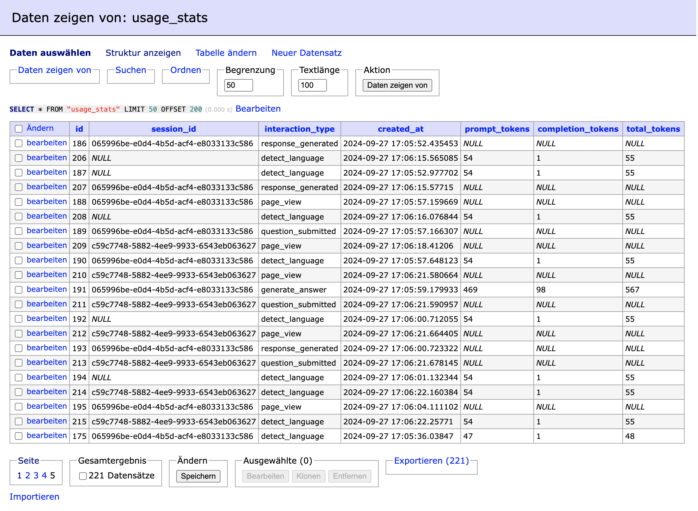
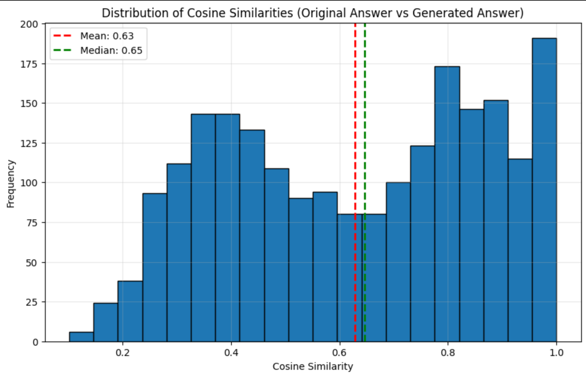
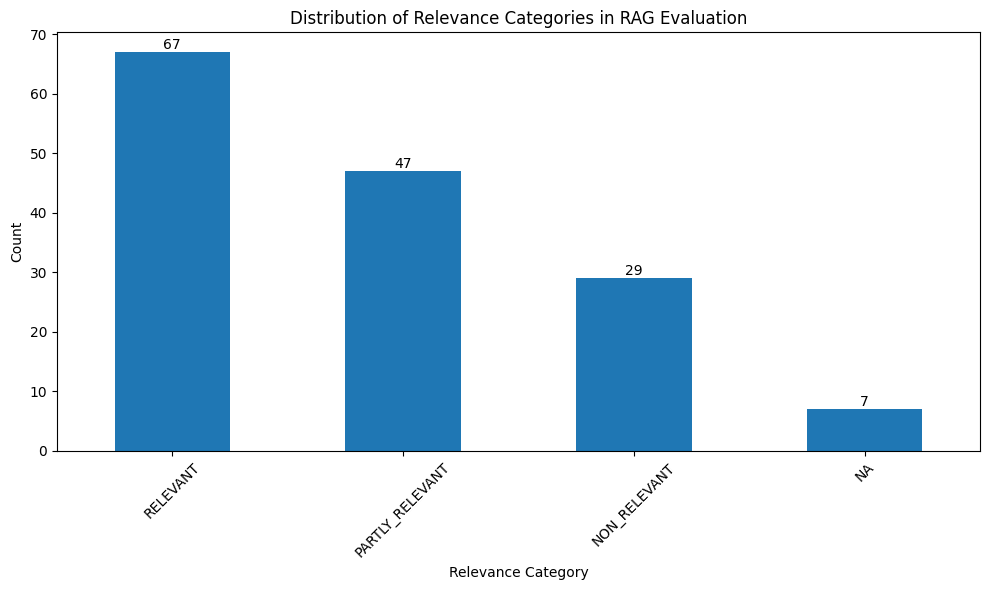

# 🤖 VDI-VDE/IT Chatbot

*...a multilingual chatbot for [VDI-VDE/IT](https://vdivde-it.de/de)*

*Designed by freepik*

### Problem description

VDI/VDE-IT is a German institute that supports innovation in technology, engineering, and digital transformation, particularly focusing on research, policy, and technology transfer.
The company has a [FAQ-Page](https://vdivde-it.de/de/faq) with frequently asked questions regarding project funding, and a rather static [chatbot](https://vdivde-it.de/de/chatbot-fuer-bmbf-projekte) which can already answer questions based on keywords and multiple-choice options.

This project implements a chatbot powered by LLM (Large Language Model) AI technology, specifically designed to assist users with questions related to administrative topics such as application submission, project duration, or support for BMBF funding. The chatbot uses a custom-built knowledge base, created by scraping the FAQ pages of the VDI/VDE-IT website, ensuring that the answers provided are accurate and relevant.

While a simple FAQ page offers static responses, this chatbot dynamically interprets and responds to user queries, handling more complex and nuanced questions and answer patterns. It enhances the user experience by delivering fast, personalized answers, making it easier to access information about VDI/VDE-IT's projects and services, and specifically about the application process for BMBF funding.

### Features:

- **📚 Knowledge Base**: Question-Answer pairs, enhanced with Links & Categories. Built from VDI/VDE-IT's FAQs via web scraping.
- **🔍 Retrieval evaluation**: Text and vector-based evaluation (ElasticSearch). Vector-based embeddings on questions, answers, and a combined approach, using a ground truth dataset consisting of alternative formulations of a question: Does the chatbot find the original question belonging to its alternative siblings in the retrieval process?
- **🤖 RAG Evaluation**: The answers given by the RAG were assessed based on a *ground truth* dataset consisting of alternative formulations of a question: *Will the chatbot deliver relevant answers if alternative questions are being asked for the same problem?*
- **💻 Interface**: Streamlit UI
- **⚙️ Ingestion pipeline**:

  - `./scrape.py` scrapes relevant data (IDs are created when generating ground truth dataset during evaluation)
  - `./app/index_docs.py` indexes documents using ElasticSearch. This script is also executed when running `docker-compose`
- **Monitoring**: Grafana Dashboard

***Monitoring data in the postgres database***

- **Containerization**:

  - docker-compose featuring the following components:
    - **postgres database** for storing monitoring usage data
    - **adminer** for accessing the database tables
    - **ElasticSearch** for indexing documents
    - **Streamlit** App for a graphical user interface
- Reproducibility:

  - Instructions: See [How to use](#usage)
  - Dataset: `documents_with_ids.json` inside `./data` and `./app/app_data` folder
  - code running (hope so)
  - dependencies (managed via docker-compose)
- **Best Practices**:
- Hybrid search 👍
- Document re-ranking (TODO)
- user query rewriting (TODO)

Bonus

- Cloud Deployment (TODO)

### How to Use {#usage}:

1. Install [Docker](https://docs.docker.com/engine/install/https:/), [Docker Compose](https://docs.docker.com/compose/install/) & [git](https://git-scm.com/downloads)
2. Clone this repository to your local hard drive

   ```
   git clone https://github.com/Alexander-Heinz/vdi_chatbot.git
   ```
3. In Terminal, navigate to project root folder, rename .env.dev to .env and edit it to add your OpenAI API Key using these commands:

   ```
   cd vdi_chatbot
   cp .env.dev .env
   rm .env.dev
   nano .env
   ```
4. Still in project root folder, use `docker-compose up` to build and run the app on your computer. This process can take some minutes and you'll be informed by the progress in terminal. As soon as you see `You can now view your Streamlit app in your browser` it should be done.
5. `http://localhost:8501`  should open in your web browser

# Detailed description

A more detailed description of the project & the single steps and challenges

### Scrape relevant documents

In the first step, I looked for a way to scrape the FAQ documents on https://www.vdivde-it.de/de/faq. I used the search function via the dropdown menu to search for all questions in a specific category, in order to scrape them. Main Challenges were:

- Content was loaded via JavaScript, so selenium was needed for scraping
- Making my script click on an element if the answer was not fully visible, in order to see the full answer, and then navigate back

In the end, I managed to scrape the FAQ Questions among with their respective answers and categories. I also added a link to the specific question, so the chatbot can give references to the FAQ webpage.

### Indexing documents

As a next step, the scraped documents were "indexed" via ElasticSearch. Elasticsearch is a tool that helps users quickly search through large amounts of data, like documents or records, and find exactly what they need. It’s like a supercharged search engine that makes it easy to get answers fast, even from big and complex information sources. Indexing in Elasticsearch is like creating an organized catalog for a library. When you add data to Elasticsearch, it breaks it down into searchable parts and stores it in a structured way (the "index"). This makes it easy and fast to find specific information later, just like looking up a book by its title or topic in a library catalog.

#### Simple indexing using ElasticSearch

Text indexing in Elasticsearch works like a traditional search engine. It breaks down text into individual words (tokens), stores them in a structured way, and matches them with search queries based on exact word matches or close similarities. It's great for finding specific terms or phrases in documents.

#### Advanced indexing using Vector Embeddings (sentence embeddings)

Vector (embedding-based) indexing, on the other hand, uses machine learning to represent text as numerical vectors (embeddings) that capture the meaning of the content. Instead of matching exact words, it measures how close the meaning of the query is to the meaning of the indexed text. This method is more flexible and effective for finding related or contextually similar information, even if the exact words don’t match.

### Create Ground Truth data

To evaluate retrieval, we need some "ground truth" that we base our scores on. The ground truth consists of alternative questions that could be asked for the same answer.

### Evaluating Retrieval

As a baseline, retrieval from text-based search was evaluated using hit rate and MRR.

**Hit rate** is a sort of a success score. It tells how often the chatbot finds a relevant answer from the FAQs when a user asks a question. A higher hit rate means the chatbot is doing a good job of retrieving the right answers.

**MRR (Mean Reciprocal Rank)** is a way to measure not just if the chatbot found a correct answer based on a user query, but also how much "on top" the correct answer was ranked. In my case, MRR (Mean Reciprocal Rank) measures how well the chatbot retrieves the right answers from the FAQs based on alternative ways of asking the same question. After generating similar questions, the chatbot searches for the best matches in our documents using ElasticSearch, and the top 5 results are ranked. MRR checks how high the correct document (question-answer-pair which the "alternative question" was based on) appears in those rankings—the sooner it shows up (like in the first or second position), the better the score. This way, you can tell how effectively the chatbot finds the right information, even with different ways of asking the question.

- Retrieval evaluation

  - for each record (Answer) in the FAQ, generate 5 questions which possibly address this answer.
  - Next, we input the questions into our search function to see if the desired answer would actually be among our top results
  - Use scoring algorithms to get an objective measure of retrieval quality
  - Caveat: We did not verify that the questions are actually valid, since we created the "ground truth" using an LLM.

# Evaluation the RAG

In this step, I generated answers based on the "ground truth" dataset, which consists of alternative ways of answering a question.

The goal was to see whether my RAG answers questions correctly if the questions are formulated in a different way.

We can compare the given answers to our alternative questions with the original answers in our dataset by using cosine similarity

***Monitoring data in the postgres database***


...or by using LLM-as-a-judge:

```
You are an expert evaluator for a Retrieval-Augmented Generation (RAG) system.
Your task is to analyze the relevance of the generated answer compared to the original answer provided.
Based on the relevance and similarity of the generated answer to the original answer, you will classify
it as "NON_RELEVANT", "PARTLY_RELEVANT", or "RELEVANT".
Please also take the generated question into account. If the generated Question is clearly not related to the original question, please classify relevance as "NA".

Here is the data for evaluation:

Original Question: {original_question}
Generated Question: {Question}
Original Answer: {answer_orig}
Generated Answer: {answer_llm}

Please analyze the content and context of the generated answer in relation to the original
answer and provide your evaluation in parsable JSON without using code blocks:

{{
  "Relevance": "NON_RELEVANT" | "PARTLY_RELEVANT" | "RELEVANT" | "NA",
  "Explanation": "[Provide a brief explanation for your evaluation]"
}}
```


***Relevance of the given answers***
