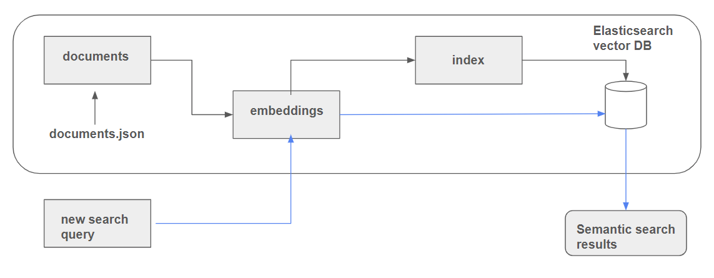

# vdi_chatbot
a chatbot for VDI

NEXT STEPS:
- Retrieval evaluation (ok) DOCUMENT!!!
- RAG evaluation (ok) DOCUMENT!!!
- Create streamlit UI
- Monitoring 
- Ingestion
- Containerizing (Docker)
    - make app run on local browser using only docker-compose

TODO: 2 points: Multiple retrieval approaches are evaluated, and the best one is used

### Problem description

VDI/VDE-IT is a German institute that supports innovation in technology, engineering, and digital transformation, particularly focusing on research, policy, and technology transfer.
The company has a FAQ-Page with frequently asked questions regarding project funding, and a rather static chatbot which can already answer questions based on keywords and multiple-choice options.

This project implements a chatbot powered by LLM (Large Language Model) AI technology designed to assist users by answering questions related to VDI/VDE-IT's focus areas in technology, engineering, and digital innovation. The chatbot uses a custom-built knowledge base, created by scraping the FAQ pages of the VDI/VDE-IT website, ensuring that the answers provided are accurate and relevant.

While a simple FAQ page offers static responses, this chatbot dynamically interprets and responds to user queries, handling more complex and nuanced questions. It enhances the user experience by delivering fast, personalized answers, making it easier to access information about VDI/VDE-IT's projects and services.

### Features:
Dynamic Q&A: Leverages the power of LLM to deliver more flexible and context-aware responses.
Knowledge Base: Built from VDI/VDE-IT's FAQs via web scraping.
Efficient Information Retrieval: Enables users to access relevant information quickly, without needing to search through static pages.

### Technologies Used:
- Python (for web scraping and LLM integration)
- Large Language Models (for intelligent question answering)
- Docker (for containerizing the application, TODO)
- Vector Database (TODO)

### How to Use:
Clone this repository and follow the setup instructions to deploy the chatbot locally or integrate it into a web application. The chatbot can be customized to suit different use cases or expanded with additional data sources.

Steps taken:

### Scrape relevant documents: FAQ with section names
In the first step, I looked for a way to scrape the FAQ documents on https://www.vdivde-it.de/de/faq. I used the search function via the dropdown menu to search for all questions in a specific category, in order to scrape them. Main Challenges were:
    - Content was loaded via JavaScript, so selenium was needed for scraping
    - Making my script click on an element if the answer was not fully visible, in order to see the full answer, and then navigate back
In the end, I managed to scrape the FAQ Questions among with their respective answers and categories. (todo) I also added a link to the specific question, so the chatbot can give references to the FAQ webpage.

### Indexing documents
    As a next step, the scraped documents were "indexed" via ElasticSearch. Elasticsearch is a tool that helps users quickly search through large amounts of data, like documents or records, and find exactly what they need. It’s like a supercharged search engine that makes it easy to get answers fast, even from big and complex information sources. Indexing in Elasticsearch is like creating an organized catalog for a library. When you add data to Elasticsearch, it breaks it down into searchable parts and stores it in a structured way (the "index"). This makes it easy and fast to find specific information later, just like looking up a book by its title or topic in a library catalog.

#### Simple indexing using ElasticSearch
    Text indexing in Elasticsearch works like a traditional search engine. It breaks down text into individual words (tokens), stores them in a structured way, and matches them with search queries based on exact word matches or close similarities. It's great for finding specific terms or phrases in documents.

#### advanced indexing using Vector Embeddings (sentence embeddings)
    Vector (embedding-based) indexing, on the other hand, uses machine learning to represent text as numerical vectors (embeddings) that capture the meaning of the content. Instead of matching exact words, it measures how close the meaning of the query is to the meaning of the indexed text. This method is more flexible and effective for finding related or contextually similar information, even if the exact words don’t match.

### Evaluating Retrieval
As a baseline, retrieval from text-based search was evaluated using hit rate and MRR.
**Hit rate** is like a success score. It tells how often the chatbot finds a relevant answer from the FAQs when a user asks a question. A higher hit rate means the chatbot is doing a good job of retrieving the right answers.

**MRR (Mean Reciprocal Rank)** is a way to measure not just if the chatbot found a correct answer based on a user query, but also how much "on top" the correct answer was ranked. In my case, MRR (Mean Reciprocal Rank) measures how well the chatbot retrieves the right answers from the FAQs based on alternative ways of asking the same question. After generating similar questions, the chatbot searches for the best matches in our documents using ElasticSearch, and the top 5 results are ranked. MRR checks how high the correct document (question-answer-pair which the "alternative question" was based on) appears in those rankings—the sooner it shows up (like in the first or second position), the better the score. This way, you can tell how effectively the chatbot finds the right information, even with different ways of asking the question.

- Store embeddings in Vector Database (TODO)

- Create a search function for searching relevant documents based on queries: Relevant _FAQ Questions_ in relevant _Categories_ based on _user queries_ (Questions asked by users)
    - use ElasticSearch / Vector Search for sentence similiarity

- Retrieval evaluation
    - for each record (Answer) in the FAQ, generate 5 questions which possibly address this answer. 
    - Next, we input the questions into our search function to see if the desired answer would actually be among our top results
    - Use scoring algorithms to get an objective measure of retrieval quality
    - Problem: We did not verify that the questions are actually valid, since we created the "ground truth" using an LLM.

- Offline evaluation: LLM as a judge 

